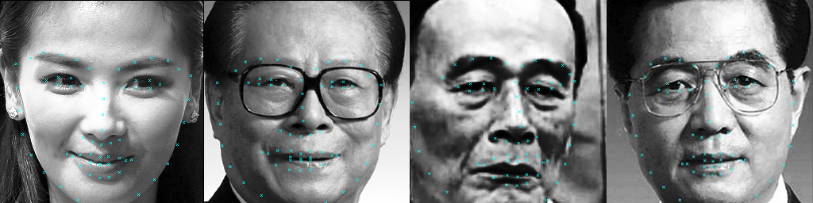

FaceAlignment.NET
=========================

C++/CLI implementation of Face Alignment at 3000 FPS via Regressing Local Binary Features(LBF). 

Accroding: *Ren, Shaoqing, et al. "Face alignment at 3000 fps via regressing local binary features." Proceedings of the IEEE Conference on Computer Vision and Pattern Recognition. 2014.*

### Prepare Data
**In view of that we pre-trained model, this step can be omitted.**

We can download dataset from [here](dataset). The dataset contains 68 points for every face, however it doesn't provide a bounding box for faces. We need our face detector to generate face bounding box (I think it is resonable because we should ues the same face detector for training and prediction).

Download the dataset and extract the data (xxx.jpg and xxx.pts) to the directory `data`, e.g. `data/68`. We also need two text file `data/68/Path_Images_train.txt` and `data/68/Path_Images_test.txt` to list the images used for train and test. The path can be relative like `../data/68/xxx.jpg` or absolute like `/home/zhangjie/projects/FaceAlignment.NET/data/68/xxx.jpg` or `C:/projects/FaceAlignment.NET/data/68/xxx.jpg`.

### Build the project

We only need [OpenCV][opencv] and [Visual Studio][vs] to build the project. Open the solution and compile the FaceAlinment project in x64 platform and CLR support mode.

If you are on Linux, simply use `make` to compile the project. 
```
$ git clone https://github.com/inlmouse/FaceAlignment.NET.git
$ cd face-alignment-at-3000fps
$ mkdir build && cd build
$ cmake ..
```

After you built, there will a dynamic link library as output: *FaceAlinment.dll*. This dll is able to used in both C++ or C# environment.

### Train
**In view of that we pre-trained model, this step can be omitted.**

Since we have prepare the data, `$ ./FaceAlignment prepare` will generate two text file `train.txt` and `test.txt` under `../data/68`. These text files are used for training and testing, each line points out an image path and face bounding box in this image with facial points location. We use cascade detector provided by OpenCV, you can use your own face detector to generate these two text file.

`$ ./FaceAlignment train` will start training and result will be lied in the directory `model`. `$ ./FaceAlignment test` will test the model on test data. If you have a Desktop Environment on the Linux, `$ ./FaceAlignment run` will do the prediction over test data by presenting a window to show the result.

### Tuning

The Configure is under `src/lbf/common.cpp/Config::Config`, modify the config under your own condition.

### Notice

The relative path used in source code are all start from `../build`, you may change this under your own condition.

### Pre-trained Model

I have trained a model for 68 facial keypoints, the model can be downloaded from [BaiduYun](http://pan.baidu.com/s/1kUXBsA7).

### Demo

We also provide a demonstration to show how to use this lib(FaceAlinment.dll). 
```cs
 ABox aBox = new ABox(0, 0, 256, 256);//Give a region to limit the boundary of the image
 LbfCascade cas = new LbfCascade(@"GlasssixLandmarks.model");//Instantiate the processor and load the pre-trained model
 double[,] landmatks = cas.Predict(openFileDialog.FileName, aBox);//Pridect landmarks
 Bitmap bmp = new Bitmap(openFileDialog.FileName);
 int count = 0;
 for (int i = 0; i < 68; i++)
 {
     if (Convert.ToInt32(landmatks[i, 0]) < 255 && Convert.ToInt32(landmatks[i, 0]) > 1 && Convert.ToInt32(landmatks[i, 1]) < 255 && Convert.ToInt32(landmatks[i, 1])>1)
     {   //Draw the results to the image without OpenCV
         bmp.SetPixel(Convert.ToInt32(landmatks[i, 0]), Convert.ToInt32(landmatks[i, 1]), Color.Aqua);
         bmp.SetPixel(Convert.ToInt32(landmatks[i, 0]) + 1, Convert.ToInt32(landmatks[i, 1]) + 1, Color.Aqua);
         bmp.SetPixel(Convert.ToInt32(landmatks[i, 0]) - 1, Convert.ToInt32(landmatks[i, 1]) - 1, Color.Aqua);
         bmp.SetPixel(Convert.ToInt32(landmatks[i, 0]) + 1, Convert.ToInt32(landmatks[i, 1]) - 1, Color.Aqua);
         bmp.SetPixel(Convert.ToInt32(landmatks[i, 0]) - 1, Convert.ToInt32(landmatks[i, 1]) + 1, Color.Aqua);
         count++;
     }

}
FileInfo file = new FileInfo(openFileDialog.FileName);
Console.WriteLine(count);
bmp.Save(@"results\"+file.Name);//Save image
pictureBox1.Image = bmp;//Show image
```

### Some Test



### Reference
If you use this code for any kind of publication please include the following references:
```
@inproceedings{ren2014face,
  title={Face alignment at 3000 fps via regressing local binary features},
  author={Ren, Shaoqing and Cao, Xudong and Wei, Yichen and Sun, Jian},
  booktitle={Proceedings of the IEEE Conference on Computer Vision and Pattern Recognition},
  pages={1685--1692},
  year={2014}
}
```
- [Datasets][dataset]
- [Face Alignment at 3000 FPS via Regressing Local Binary Features](http://research.microsoft.com/en-US/people/yichenw/cvpr14_facealignment.pdf)

[dataset]: http://ibug.doc.ic.ac.uk/resources/facial-point-annotations
[opencv]: http://opencv.org/
[cmake]: http://www.cmake.org/
[vs]: https://www.visualstudio.com/

### Contributors

-inlmouse 2016-06-21 23:38:48